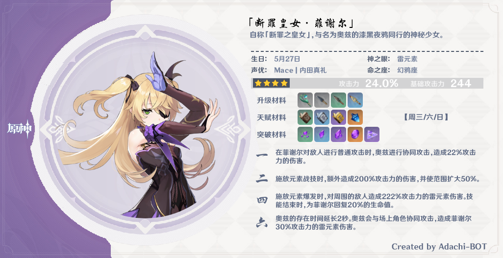
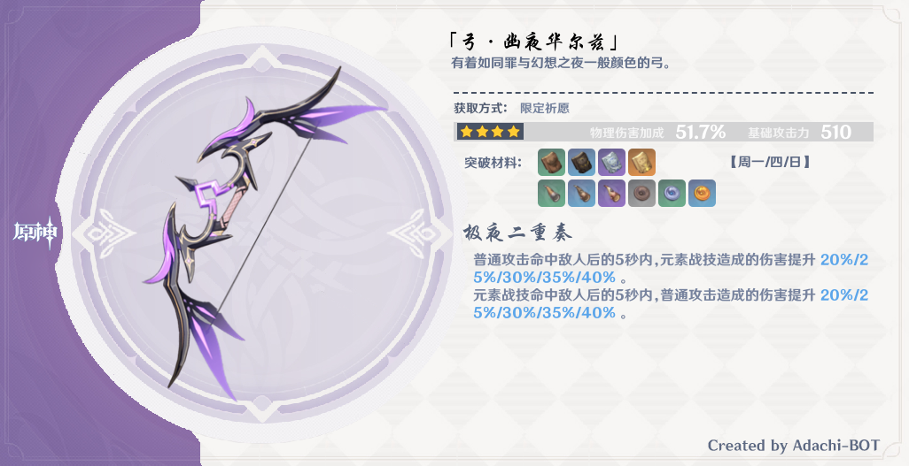

# Adachi-BOT

## 说明

### 关于

本项目提供了一个在 QQ 中运行的原神助手，与之聊天可以方便地查询玩家数据和游戏信息、模拟抽卡、模拟刷圣遗物，以及一些其他的[功能](https://github.com/Arondight/Adachi-BOT#%E5%8A%9F%E8%83%BD)。[原项目](https://github.com/SilveryStar/Adachi-BOT)的[该版本](https://github.com/SilveryStar/Adachi-BOT/tree/ver1.4.6)已经不再维护，此项目当前会持续更新。

请抵制任何形式使用该项目盈利的行为，如有需要请自行（或与朋友共同）搭建一个。如果你很喜欢本项目可以去[打赏原作者](https://afdian.net/@SilveryStar)，我不需要赞助。

### 文档

1. 常见问题请参阅 [FAQ](https://github.com/Arondight/Adachi-BOT/issues?q=label%3Adocumentation) 。
2. 资源文件提交请查阅[资源制作](docs/资源制作.md)。
3. 插件开发请查阅[开发指引](docs/开发指引.md)。

### 开发

1. 代码提交前运行 `npm run check` 进行检查确保无报错，并运行 `npm run format` 进行格式化。
2. 代码自测完毕后发起 [Pull request](https://github.com/Arondight/Adachi-BOT/pulls) 合入 `dev` 分支。
3. 新功能添加或者功能修改请先发起 [Issue](https://github.com/Arondight/Adachi-BOT/issues) 询问我的意愿，根据沟通结果选择合入本项目或者提交到你账户下的一个 Fork 。漏洞修复无需事先沟通，直接发起 [Pull request](https://github.com/Arondight/Adachi-BOT/pulls) 并描述清楚问题即可。
4. 请不要在你的 Fork 中开启 `Update resources in dev branch` 这个 workflow ！它对你没有任何帮助。

## 使用

### 部署

本项目原则上只做 Linux 系统的支持，所有代码合入主线之前也只在 Linux 上进行测试，推荐使用一个主流的[发行版](https://zh.wikipedia.org/wiki/Linux%E5%8F%91%E8%A1%8C%E7%89%88)（例如 [CentOS](https://www.centos.org/) ）进行部署。如果你执意要在 Windows 系统上进行部署，请参照我在 [FAQ](https://github.com/Arondight/Adachi-BOT/issues?q=label%3Adocumentation) 中写的《如何在 Windows 系统上进行部署》，注意虽然这份说明是出自我之手，但是不表示我推荐在 Windows 系统上部署本项目。

#### 准备环境

> 建议提供一个内存和交换空间容量**总和**达到 `1.5 GiB` 的 Linux 环境进行部署，以运行无头浏览器。

首先你需要有一份较新的 [Node.js](https://nodejs.org/en/download/) ，本项目不兼容较旧版本的 Node.js 。下面演示了两个常用的发行版系列中安装新版 Node.js 的方法，其他发行版请自行解决此问题。

##### CentOS、RHEL

```sh
sudo yum -y remove nodejs
curl -fsSL https://rpm.nodesource.com/setup_16.x | sudo -E bash -
sudo yum -y install nodejs
```

##### Ubuntu、Debian

```sh
sudo apt -y remove nodejs
curl -fsSL https://deb.nodesource.com/setup_16.x | sudo -E bash -
sudo apt -y install nodejs
```

#### 克隆项目


```sh
git clone https://github.com/Arondight/Adachi-BOT.git
cd ./Adachi-BOT/
```

<details>
  <summary>使用代理克隆本项目</summary>

如果你访问 `GitHub` 的速度很慢，那么你可以使用下面的代理克隆本项目。

```
git clone https://hub.fastgit.org/Arondight/Adachi-BOT.git
```

</details>

#### 安装依赖模块

你需要使用 `npm` 命令安装所需的依赖模块，但是因为 [Puppeteer](https://github.com/puppeteer/puppeteer.git) 在安装过程中具有特殊性，所以整个安装过程有了两种思路，你可以在下面的安装方法中任选其一。

##### 其一，（推荐）使用系统自带的 Chromium

这种做法的好处有三个。

1. 包管理器会为你提供 Chromium 安装和运行所需要的依赖。
2. 包管理器会为你提供 Chromium 安全和功能更新。
3. 你不需要在一个系统里装多份 Chromium 浏览器。

你要做的是用包管理器安装 Chromium ，然后找到它的二进制 ELF 文件路径，配置环境变量 `PUPPETEER_EXECUTABLE_PATH` 为这个路径，然后配置环境变量 `PUPPETEER_SKIP_CHROMIUM_DOWNLOAD` 为 `true` 。这样 Puppeteer 就可以使用系统自带的 Chromium 。这里以 CentOS 为例，执行以下命令。

```sh
sudo yum -y install epel-release
sudo yum -y install chromium

SHRC="${HOME}/.bashrc"
BROWER='/usr/lib64/chromium-browser/chromium-browser'
VAR_PATH='PUPPETEER_EXECUTABLE_PATH'
VAR_SKIP='PUPPETEER_SKIP_CHROMIUM_DOWNLOAD'
grep "$VAR_PATH" "$SHRC" || ( echo "export ${VAR_PATH}='${BROWER}'" | tee -a "$SHRC" )
grep "$VAR_SKIP" "$SHRC" || ( echo "export ${VAR_SKIP}='true'" | tee -a "$SHRC" )
source "$SHRC"

npm install
```

> 1. `BROWER` 需要设置为 Chromium 的二进制 ELF 路径，而**非启动脚本或其链接**的路径。
> 2. `SHRC` 是 Shell 配置文件的路径，这里的 Shell 是 `bash` 。

##### 其二，让 npm 为你安装一个 Chromium

这需要你的系统有访问国际互联网的能力，如果可以访问，直接执行以下命令。

```sh
npm install
```

如果无法访问，那么你需要通过任意合法途径获得一个可以访问国际互联网的 `http` 代理，然后执行以下命令。

```sh
npm_config_proxy=http://<代理地址>:<代理端口> npm install
```

> 注意使用此方法安装 Chromium ，你需要自行解决它的运行依赖问题（例如缺少动态库）。

### 配置

首次配置，进入本项目所在的目录 `./Adachi-BOT/`，执行以下命令从 `./config_defaults/` 下复制默认配置文件 `setting.yml` 和 `cookies.yml` 到 `./config/` 中。

```sh
cp -iv ./config_defaults/{setting,cookies}.yml ./config/
```

然后需要编辑以下文件，根据注释填入合适的配置。

| 文件 | 作用 |
| --- | --- |
| [setting.yml](config_defaults/setting.yml) | 基本配置选项 |
| [cookies.yml](config_defaults/cookies.yml) | 米游社Cookie |

> 1. 你也可以从 `./config_defaults/` 下复制更多的文件到 `./config/` 来进行自定义配置。但是有些配置文件如果你不想自己维护，那就不要把它们放到 `./config/` 下。请详细阅读相关配置文件中注释的说明。
> 2. 你可以在 [yamlchecker.com](https://yamlchecker.com/) 网站上检查你写的配置文件语法是否正确，只需要将配置文件的内容复制到文本框中即可。
> 3. 当前任何配置文件的更改都需要重启机器人方可生效。

### 运行

进入本项目所在的目录 `./Adachi-BOT/` 。

| 动作 | 命令 |
| --- | --- |
| 初始化 | `npm run init` |
| 启动 | `npm run start` |
| 重启 | `npm run restart` |
| 停止 | `npm run stop` |
| 允许开机启动 | `npm run startup` |
| 禁止开机启动 | `npm run unstartup` |
| 查看状态 | `npm run info` |
| 查看日志 | `npm run log` |

> 1. 首次运行必须**进行初始化**以完成 QQ 的新设备认证，随后按下组合键 `Ctrl+C` 停止，此时初始化完成。
> 2. 需要启动一次后才可以允许、禁止开机启动。

### 更新

进入本项目所在的目录。

#### 检查更新

```sh
./scripts/is_there_an_update_available.sh
```

#### 进行更新

```sh
git pull -p
npm install
```

#### 查看配置文件变更

```sh
./scripts/whats_updated_in_the_configuration_files.sh
```

> 你可以使用 [Meld](http://meldmerge.org/) 把 `./config_defaults/` 中的变更合并到 `./config/` 里。

#### 重启机器人

```sh
npm run restart
```

## 功能

### 所有功能

> 具体命令请查看[这里](config_defaults/command.yml)，一些只供管理者使用的主人命令请查看[这里](config_defaults/command_master.yml)。

| 功能 | 形式 | 权限开关 | 主人命令 |
| --- | --- | --- | --- |
| 展示米游社账号、 UID 或者某个群友的游戏账号 | 插件 | ✔️ | ❌ |
| 展示米游社账号、 UID 或者某个群友的深渊战绩 | 插件 | ✔️ | ❌ |
| 米游社账号绑定和改绑 | 插件 | ✔️ | ❌ |
| 圣遗物掉落和强化 | 插件 | ✔️ | ❌ |
| 圣遗物截图评分 | 插件 | ✔️ | ❌ |
| 展示角色官方数据 | 插件 | ✔️ | ❌ |
| 祈愿十连（支持定轨） | 插件 | ✔️ | ❌ |
| 今天该刷什么 | 插件 | ✔️ | ❌ |
| 今天吃什么 | 插件 | ✔️ | ❌ |
| 点歌 | 插件 | ✔️ | ❌ |
| 掷骰子 | 插件 | ✔️ | ❌ |
| 求签 | 插件 | ✔️ | ❌ |
| 主人和其他好友或群聊天、发送广播 | 插件 | ❌ | ✔️ |
| 查看、搜索和统计添加的好友和群 | 插件 | ❌ | ✔️ |
| 群广播和好友广播 | 插件 | ❌ | ✔️ |
| 查看宿主系统状态| 插件 | ❌ | ✔️ |
| 报告无效 Cookie | 插件 | ❌ | ✔️ |
| 其他管理功能和权限控制开关 | 插件 | ❌ | ✔️ |
| 随机复读群信息 | 自有功能 | ❌ | ❌ |
| 停止响应指定群 | 自有功能 | ❌ | ❌ |
| 一定时间后撤回机器人发送的群消息 | 自有功能 | ❌ | ❌ |
| 自我介绍 | 自有功能 | ❌ | ❌ |
| 上线通知 | 自有功能 | ❌ | ❌ |

### 图片示例

> 1. 有些样式可能已经变更。
> 2. 仅展示了部分功能。

<details>
  <summary>展示玩家信息</summary>
  <div align="center">


  </div>
</details>

<details>
  <summary>查询我的角色</summary>
  <div align="center">


  </div>
</details>

<details>
  <summary>查询深渊战绩</summary>
  <div align="center">


  </div>
</details>


<details>
  <summary>圣遗物掉落和强化</summary>
  <div align="center">


  </div>
</details>

<details>
  <summary>祈愿十连</summary>
  <div align="center">


  </div>
</details>

<details>
  <summary>游戏数据查询</summary>
  <div align="center">




  </div>
</details>

## 致谢

感谢以下人员以及未提及的[贡献者](https://github.com/Arondight/Adachi-BOT/graphs/contributors)们，你们让一切变得更好了。

| 人员 | 贡献 |
| --- | --- |
| [490720818](https://github.com/490720818) | [前端部分](src/views)的开发及维护，编写了深渊查询的原始版本 |
| [Mark9804](https://github.com/Mark9804) | [前端部分](src/views)的开发及维护，贡献了诸多资源文件 |
| [SilveryStar](https://github.com/SilveryStar) | 编写了项目的原始版本，提供了大量资源文件 |
| [Xm798](https://github.com/Xm798) | 贡献了诸多资源文件 |
| [buzhibujuelb](https://github.com/buzhibujuelb) | 添加了武器定轨机制，美化了抽卡效果 |
| [coolrc136](https://github.com/coolrc136) | 为项目提供了直接技术支持 |
| [ixCiel](https://github.com/ixCiel) | 优化了 Cookie 池使用逻辑 |

> 名单先后顺序根据账号首字母排列。

## 许可

[MIT License](LICENSE) 。
