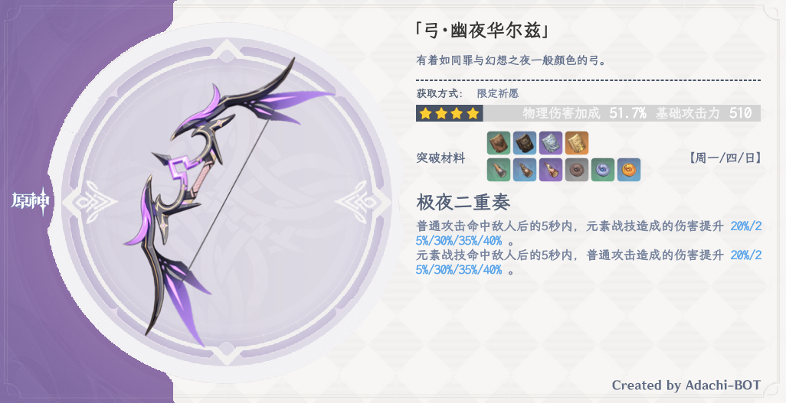

# Adachi-BOT

## 说明

[原项目](https://github.com/SilveryStar/Adachi-BOT)的[该版本](https://github.com/SilveryStar/Adachi-BOT/tree/ver1.4.6)已经不再维护，此项目当前会持续更新。

1. 插件开发请查阅[开发指引](docs/开发指引.md)。
2. 资源文件提交请查阅[资源制作](docs/资源制作.md)。
3. 常见问题请参阅 [FAQ](https://github.com/Arondight/Adachi-BOT/issues?q=label%3Adocumentation)。

> 1. 代码提交前运行 `npm run format` 进行格式化。
> 2. 所有的提交请先合入 `dev` 分支。

## 使用

### 部署

#### 准备环境

> 建议提供一个内存和交换空间容量**总和**达到 `2GiB` 的机器，以供机器人运行无头浏览器。

首先你需要有一份较新的 [Node.js](https://nodejs.org/en/download/)，机器人无法在较低版本的 Node.js 上运行。

<details>

##### CentOS、RHEL

```
sudo yum -y remove nodejs
curl -fsSL https://rpm.nodesource.com/setup_16.x | sudo -E bash -
sudo yum -y install nodejs
```

##### Ubuntu、Debian

```
sudo apt -y remove nodejs
curl -fsSL https://deb.nodesource.com/setup_16.x | sudo -E bash -
sudo apt -y install nodejs
```

</details>

#### 部署项目

```
git clone https://github.com/Arondight/Adachi-BOT.git
cd ./Adachi-BOT/
npm install
```

如果 `puppeteer` 模块下载 `Chromium` 失败，那么机器人将无法正常运行……

<details>

此时你有三种选择。首先删除 `./node_modules/` 目录。

其一，使用系统自带的 `Chromium` ，这里以 `CentOS` 为例，执行以下命令。

> 这里需要找到 `Chromium` 的二进制可执行文件路径，而非启动脚本或其链接的路径。

```
sudo yum -y install epel-release
sudo yum -y install chromium
grep PUPPETEER_EXECUTABLE_PATH ~/.bashrc || ( echo 'export PUPPETEER_EXECUTABLE_PATH=/usr/lib64/chromium-browser/chromium-browser' | tee -a ~/.bashrc )
source ~/.bashrc
PUPPETEER_SKIP_CHROMIUM_DOWNLOAD=true npm install
```

其二，通过任意合法途径获得一个可以访问国际互联网的 `http` 代理，然后执行以下命令。

```
npm_config_proxy=http://<ip>:<port> npm install
```

其三，尝试改用 `Firefox` ，执行以下命令。

```
PUPPETEER_PRODUCT=firefox npm install
```

</details>

### 配置

首次配置，进入本项目所在的目录 `./Adachi-BOT/`，执行以下命令复制默认配置文件 `setting.yml` 和 `cookies.yml`。

```
cp -iv ./config_defaults/{setting,cookies}.yml ./config/
```

然后需要编辑以下文件，根据注释填入合适的配置。

| 文件 | 作用 |
| --- | --- |
| [setting.yml](config_defaults/setting.yml) | 基本配置选项 |
| [cookies.yml](config_defaults/cookies.yml) | 米游社Cookie |

> 1. 你可以从 `./config_defaults/` 下复制更多的文件到 `./config/` 来进行自定义配置。
> 2. 有些配置文件如果你不想自己维护（例如 `artifacts.yml` ），那就不要把它们放到 `./config/` 下。
> 3. 通常来说，你只需要在 `./config/` 下存放 `setting.yml` 和 `cookies.yml` 就够了。

### 使用

进入本项目所在的目录 `./Adachi-BOT/`。

| 动作 | 命令 |
| --- | --- |
| 初始化 | `npm run init` |
| 启动 | `npm run start` |
| 重启 | `npm run restart` |
| 停止 | `npm run stop` |
| 允许开机启动 | `npm run startup` |
| 禁止开机启动 | `npm run unstartup` |
| 查看状态 | `npm run list` |
| 查看日志 | `npm run log` |

> 首次运行必须**进行初始化**以完成 QQ 的新设备认证，随后按下组合键 `Ctrl+C` 停止机器人，此时初始化完成。

### 更新

进入本项目所在的目录。

```
git pull -p
npm install
npm run restart
```

## 功能

### 所有功能

> 具体命令请查看[这里](src/plugins/tools/help.js)，一些只供管理者使用的主人命令请查看[这里](src/plugins/tools/master.js)。

| 功能 | 形式 | 权限控制 | 主人命令 |
| --- | --- | --- | --- |
| 展示米游社ID下的游戏账号 | 插件 | ✔️ | ❌ |
| 展示UID对应的游戏账号 | 插件 | ✔️ | ❌ |
| 展示UID对应的深渊战绩 | 插件 | ✔️ | ❌ |
| 米游社ID绑定和改绑 | 插件 | ❌ | ❌ |
| 圣遗物掉落和强化 | 插件 | ✔️ | ❌ |
| 圣遗物截图评分 | 插件 | ✔️ | ❌ |
| 展示角色官方数据 | 插件 | ✔️ | ❌ |
| 祈愿十连（支持定轨） | 插件 | ✔️ | ❌ |
| 今天该刷什么 | 插件 | ❌ | ❌ |
| 今天吃什么 | 插件 | ❌ | ❌ |
| 掷骰子 | 插件 | ❌ | ❌ |
| 点歌 | 插件 | ✔️ | ❌ |
| 伟大的升华 | 插件 | ❌ | ❌ |
| 与机器人的好友或群聊天 | 插件 | ❌ | ✔️ |
| 查看、搜索和统计机器人的好友和群 | 插件 | ❌ | ✔️ |
| 群广播和好友广播 | 插件 | ❌ | ✔️ |
| 其他管理功能和权限控制开关 | 插件 | ❌ | ✔️ |
| 随机复读群信息 | 自有功能 | ❌ | ❌ |
| 停止响应指定群 | 自有功能 | ❌ | ❌ |
| 自我介绍 | 自有功能 | ❌ | ❌ |
| 上线通知 | 自有功能 | ❌ | ❌ |

### 图片示例

> 1. 有些样式可能已经变更。
> 2. 仅展示了部分功能。

<details>
  <summary>展示玩家信息</summary>
  <div align="center">


  </div>
</details>

<details>
  <summary>查询我的角色</summary>
  <div align="center">


  </div>
</details>

<details>
  <summary>查询深渊战绩</summary>
  <div align="center">


  </div>
</details>


<details>
  <summary>圣遗物掉落和强化</summary>
  <div align="center">


  </div>
</details>

<details>
  <summary>祈愿十连</summary>
  <div align="center">


  </div>
</details>

<details>
  <summary>游戏数据查询</summary>
  <div align="center">




  </div>
</details>

## Licenses

[MIT](LICENSE)

